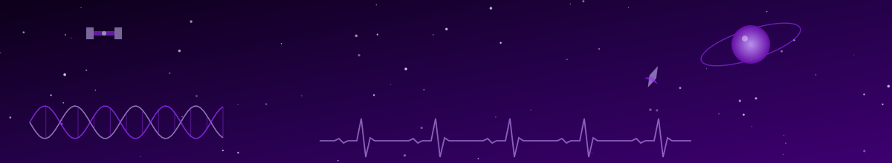

 

<table>
<tr>
<td width="50%" valign="top">

Classifies heartbeats as normal or abnormal from MIT-BIH ECG data, using patient independent cross validation and a benchmarked CNN comparison.

`Python` `TensorFlow/Keras` `Signal Processing`

</td>
<td width="50%" valign="top">

Classifies EEG segments as seizure or non-seizure using time and frequency domain features, achieving **0.949 F1** with patient grouped cross validation.

`Python` `Feature Engineering` `Scikit-learn`

</td>
</tr>
<tr>
<td width="50%" valign="top">

A live Streamlit app combining both trained models above with SHAP based explainability, deployed publicly for real time inference and interpretation.

`Streamlit` `SHAP` `Deployment`

</td>
<td width="50%" valign="top">

A MATLAB algorithm converting continuous head angle data into a 15 degree incremented steering target, built for accessible vehicle control.

`MATLAB` `Assistive Tech`

</td>
</tr>
</table>

Reconstructing a real spacecraft star catalog from Varahamihira's 6th century *Brihat Samhita*, aiming toward a simulated lost in space star identification and attitude determination pipeline. Ancient astronomy meets modern spacecraft GNC.

`Attitude Determination` `Star Identification` `History of Astronomy`

  

